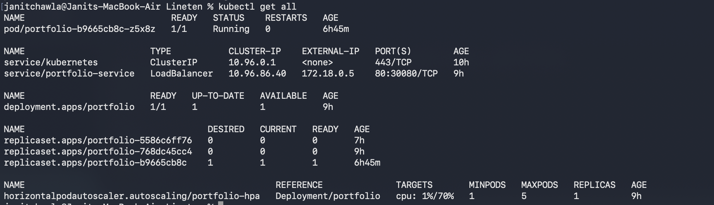
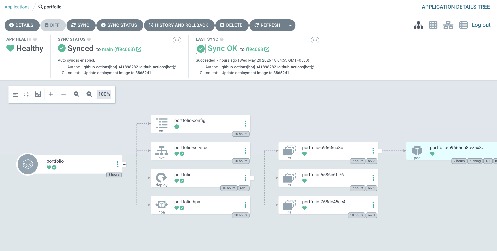
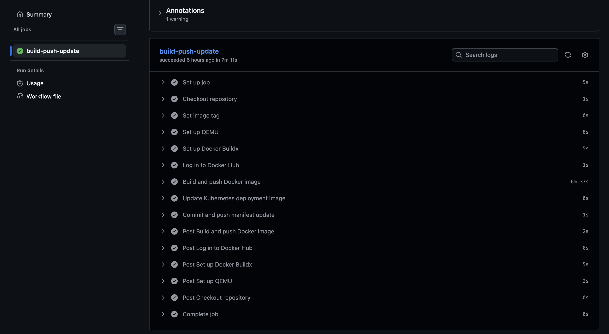
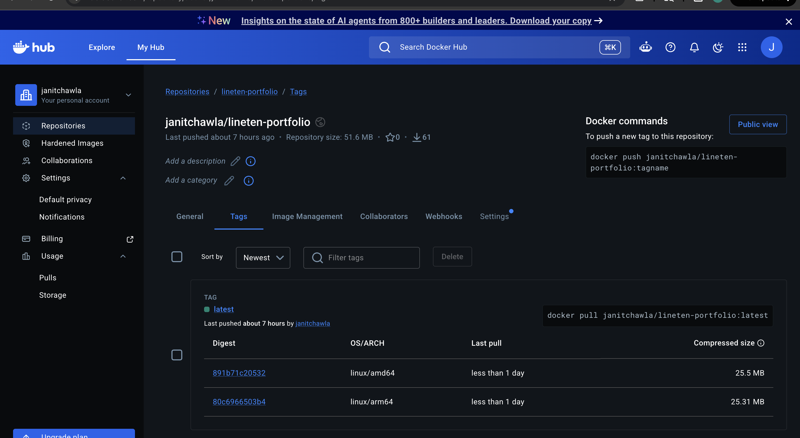

# Lineten Portfolio SRE Exercise

A React portfolio app packaged with Docker, deployable to Kubernetes, and designed to be managed through a GitOps workflow with Argo CD.

## What Is Included

- React application served by nginx
- Docker image build using the root `Dockerfile`
- Docker compose file for starting the container
- Kubernetes manifests in `kubernetes/`
- Argo CD application manifest in `argocd/`
- Terraform EKS example in `terraform_eks/`
- GitHub Actions workflow that builds and pushes Docker images to Docker Hub

## Exercise Coverage

MVP items:

- IaC managed via Terraform: `terraform_eks/` demonstrates an EKS cluster, managed node group, EKS add-ons, and useful outputs.
- Git repository with multiple commits: intended to be reviewed through normal Git history.
- Deployed on every commit: GitHub Actions builds and pushes an image on each `main` commit, then updates the Kubernetes deployment image tag.
- Cloud provider target: AWS EKS is provided as the cloud deployment target.
- Documentation: this README documents the implementation choices and tradeoffs.

Nice-to-have items:

- Kubernetes: manifests are provided for Deployment, Service, ConfigMap, and HPA.
- GitOps: Argo CD `Application` manifest is included.
- Docker Compose: `docker-compose.yaml` can run the app locally.
- Public internet: on EKS, the `LoadBalancer` service would provision an AWS load balancer.

## Public Demo

The application is currently accessible at:

```text
http://3.19.241.71/
```

The repository also includes Kubernetes, Argo CD, and Terraform EKS manifests to show how the same image can be deployed through a cloud-native workflow.

## Docker

Build the image locally:

```bash
docker build -t lineten-portfolio:latest .
```

Run it locally:

```bash
docker run --rm -p 80:80 lineten-portfolio:latest
```

Then open:

```text
http://localhost
```

You can also use Docker Compose:

```bash
docker compose up --build
```

## Kubernetes

The Kubernetes manifests are in `kubernetes/`:

- `configmap.yaml`: application environment variables
- `deployment.yaml`: app deployment
- `service.yaml`: app service
- `hpa.yaml`: horizontal pod autoscaler

Apply the manifests:

```bash
kubectl apply -f kubernetes/
```

Check the resources:

```bash
kubectl get pods
kubectl get svc portfolio-service
kubectl get hpa
```



For a local Kubernetes cluster such as Docker Desktop, the service is configured as `LoadBalancer`, so the app should be available at:

```text
http://localhost
```

On EKS, the same service type would create an AWS load balancer. The public address can be checked with:

```bash
kubectl get svc portfolio-service
```

If needed, use port forwarding:

```bash
kubectl port-forward service/portfolio-service 8080:80
```

Then open:

```text
http://localhost:8080
```

The application exposes the following endpoints:

```text
/
/health
```

The `/health` endpoint is served by nginx and is used by the Kubernetes liveness and readiness probes.

## Argo CD

The Argo CD application manifest is:

```text
argocd/portfolio.yaml
```

Apply it after Argo CD is installed in the cluster:

```bash
kubectl apply -f argocd/portfolio.yaml
```

Check the application:

```bash
kubectl get applications -n argocd
kubectl describe application portfolio -n argocd
```

Argo CD watches the `kubernetes/` folder on the `main` branch and syncs changes into the cluster.

The application uses the default Argo CD project to keep the demo self-contained. In a larger setup this could be moved into a dedicated `AppProject` with explicit source repository and destination restrictions.



## GitHub Actions

The workflow is defined in:

```text
.github/workflows/dockerhub-deploy.yaml
```

On every push to `main`, it:

1. Builds a multi-architecture Docker image for `linux/amd64` and `linux/arm64`
2. Pushes the image to Docker Hub
3. Tags the image with the short Git commit SHA and `latest`
4. Updates `kubernetes/deployment.yaml` with the new image tag
5. Commits and pushes the deployment manifest update

The workflow ignores README-only changes and deployment image tag commits, so documentation updates and bot commits do not trigger unnecessary image builds.

Required GitHub repository secrets:

```text
DOCKERHUB_USERNAME
DOCKERHUB_TOKEN
```

The image repository used by the workflow is:

```text
<DOCKERHUB_USERNAME>/lineten-portfolio
```



The pushed image is visible in Docker Hub:



## Terraform EKS

The Terraform files in `terraform_eks/` demonstrate how this application could be hosted on AWS EKS.

They define:

- An EKS control plane
- A managed node group
- Public subnet discovery by VPC tag
- Core EKS add-ons, including `metrics-server` for HPA support
- Outputs for kubeconfig, Helm, and follow-up integrations

This directory is intended as an infrastructure example for the exercise. It assumes the VPC and IAM roles already exist, and it is not required for running the local Docker Desktop Kubernetes demo.

Typical commands would be:

```bash
cd terraform_eks
terraform init
terraform plan
```

The cluster is not automatically created by the GitHub Actions workflow because that would consume cloud resources on every repository change.

## Implementation Choices And Tradeoffs

- The app is served by nginx because the React build is static and does not need a Node.js runtime in production.
- Docker images are tagged with the short Git SHA for traceability, while `latest` is also pushed for convenience.
- The GitHub Actions workflow commits the new image tag back into `kubernetes/deployment.yaml`; this gives Argo CD a Git change to sync.
- The workflow ignores README-only changes and deployment tag commits to avoid unnecessary builds and commit loops.
- Kubernetes probes use `/health`, which is implemented in `nginx.conf`.
- The HPA is included to show autoscaling behavior. It requires metrics-server, which is included in the EKS Terraform example.
- The EKS Terraform uses existing VPC and IAM roles to keep the example focused and avoid overbuilding account-specific networking and identity resources.
- Worker nodes are shown in public subnets for a simple demo. For production, private subnets and tighter network controls would usually be preferred.

## Image Pull Notes

If a pod fails with an error like:

```text
no match for platform in manifest
```

the image was built for a different CPU architecture than the Kubernetes node. The GitHub Actions workflow builds both `linux/amd64` and `linux/arm64` images to support common local clusters, including Docker Desktop on Apple Silicon.
